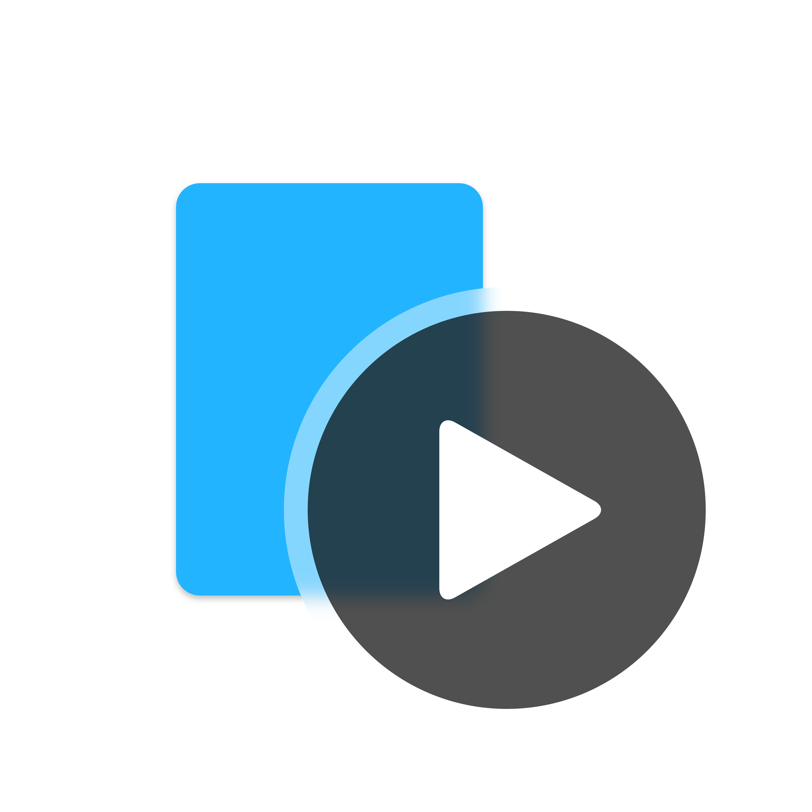

<!---->

# NonsPlayer

A music player that can be controlled remotely

***

# ⭐Highlights

- Allows you to play music **On Multiple Platforms** (Windows play, Android control)
- Allows you to play music **From Multiple Platforms** and local music
- **Beautiful | Simple** lyrics display
- **Beautiful UI**, easy to use
- **Small Memory Footprint**, almost **No Impact** on performance
- **Stable Updates**

# 📦About

See [NonsPlayer Github Repo](https://github.com/Miaoyww/NonsPlayer)

# 📜Open Source License

Copyright Miaoyww 2022-2024.  

Distributed under the terms of
the [GPL-3.0 license](https://github.com/Miaoywww/NeteaseCloudMusicControl/blob/master/LICENSE.txt).